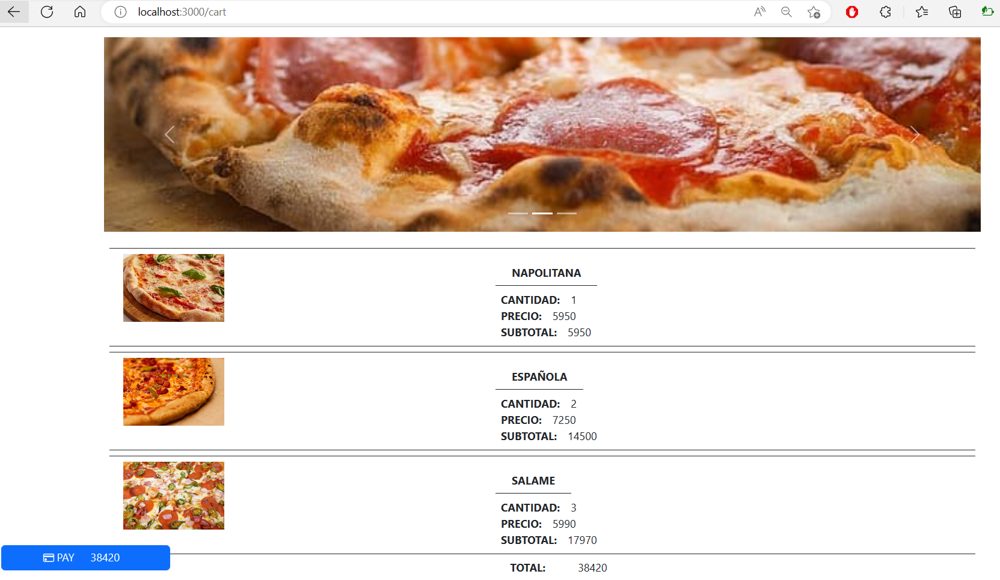

# REACTI_DESAFIO04

React JS II Desafio 04, Mamma Mia!

Cada card tiene un botón favorito para agregar y pizzas, se tiene tanto en el menú como en la parte inferior un enlace para poder ver el carro de compra. Se hace uso de useContext, useEffect, 
useState, useNavigate dentro de la aplicación.

## INSTALAR LIBRERIAS
npm install

## DESPLEGAR
npm run start

## PRESENTACIÓN
[VIDEO](https://youtu.be/7cb355k665I)

