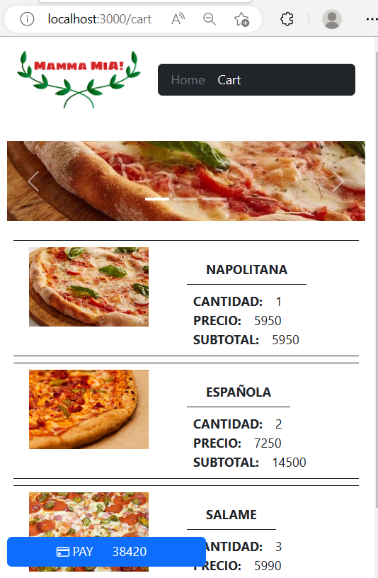

# REACTI_DESAFIO04

React JS II Desafio 04, Mamma Mia!

Cada card tiene un botón para agregar y quitar pizzas, se tiene tanto en el menú principal como en la parte inferior un enlace para poder ver el carro de compra con el detalle de las pizzas además de visualizarse el monto a pagar. Se hace uso de useContext, useEffect, useState, useNavigate dentro de la aplicación para poder realizar las diversas acciones en la aplicación.

## INSTALAR LIBRERIAS
npm install

## DESPLEGAR
npm run start

## IMAGENES DE REFERENCIA

## PRESENTACIÓN
[VIDEO](https://youtu.be/7cb355k665I)

